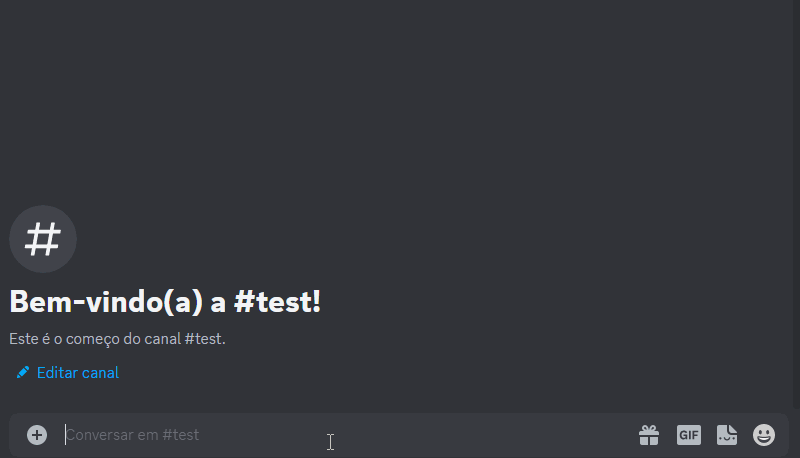
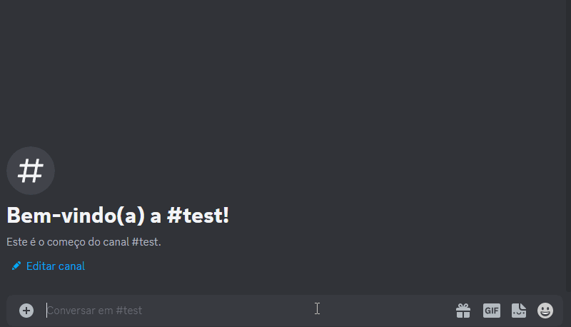

# QuizBot

### Commands
* /list
* /info
* /play

### Adding new quizzes
Currently, the only way to add new quizzes is to create a new file
and placing it in the "quizzes" folder.

The file must be a json, the format can be checked in the default quiz file: test.json

### Images



### Building
1. Clone the project repository:

```git clone https://github.com/PHSSGG/QuizBot```

2. Navigate to the project's root directory:

```cd QuizBot```

3. Build the project using Gradle and ShadowJar:

```./gradlew shadowjar```

4. The project jar will be located at:

```build/libs/QuizBot-1.0-SNAPSHOT-all.jar```

### Running

Run the bot with the command:

```java -jar QuizBot-1.0-SNAPSHOT-all.jar "mongo connection url" "bot token"```